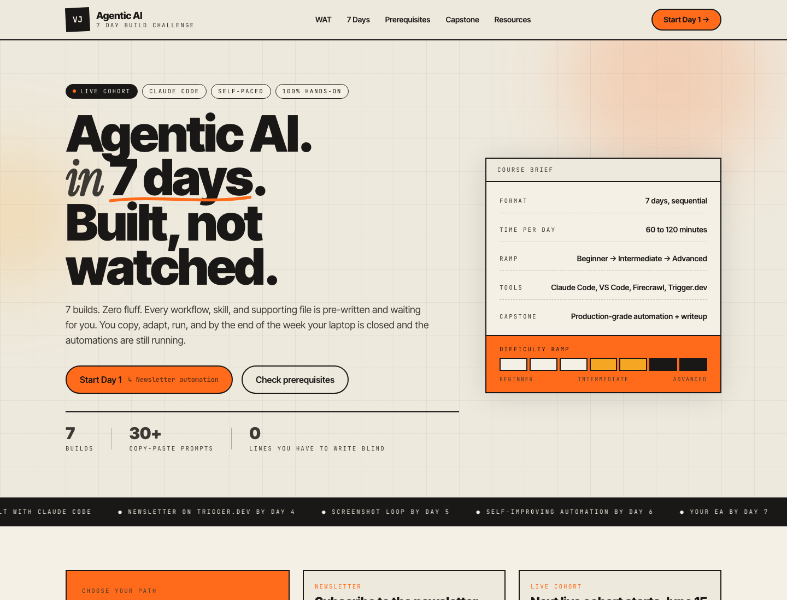
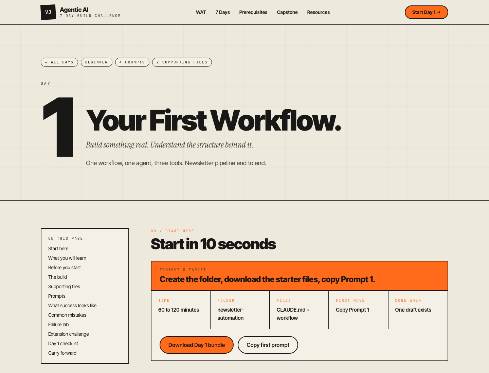
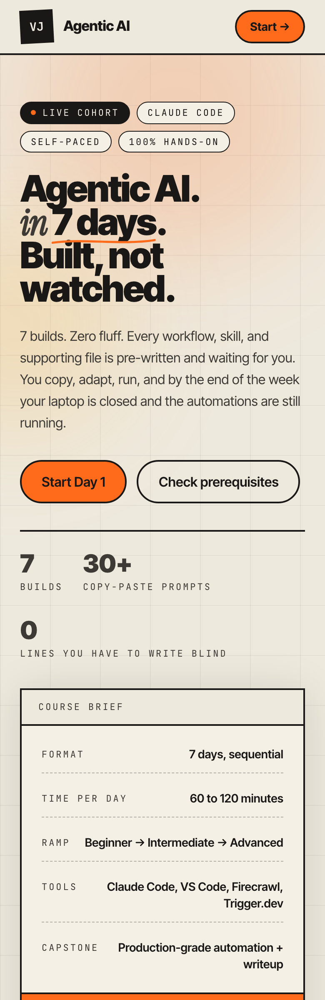

# Build With Agents

> A free 7-day hands-on challenge to build real agentic AI automations with Claude Code.

[Start the challenge](https://buildwithagents.vercel.app/) · [Course walkthrough](docs/COURSE-WALKTHROUGH.md) · [Learning path](docs/LEARNING-PATH.md) · [Usage rules](COPYRIGHT.md)

## What this repo is

This is the public GitHub landing repo for [Build With Agents](https://buildwithagents.vercel.app/).

The goal is simple:

- Help builders discover the course on GitHub.
- Give people a clear walkthrough before they start.
- Earn stars from people who want practical agentic AI examples.
- Send learners to the official site for the full course experience.

This repo is not the private course source repo. It does not contain the website code, private course files, downloadable resource bundles, or internal deployment setup.

## Start here

The full course lives at:

[https://buildwithagents.vercel.app/](https://buildwithagents.vercel.app/)

Star this repo if you want to keep the challenge handy, share it with your team, or follow the build-in-public progress around practical AI agents.

## Screenshots from the live site

These screenshots are captured from the actual Build With Agents site.

| Homepage | Day 1 page |
| --- | --- |
|  |  |

Mobile preview:

## Why Build With Agents exists

Most AI agent content stops at demos. Build With Agents is for people who want working systems.

In 7 days, you move from your first Claude Code workflow to deployed automation, reusable skills, screenshot-based frontend iteration, scheduled routines, and a personal executive assistant workspace.

The course is practical by design:

- 7 days
- 7 builds
- Copy-ready prompts
- Concrete checklists
- Claude Code, MCP, Trigger.dev, workflows, skills, and scheduled routines
- Real failure cases and recovery patterns
- A capstone that turns the week into a production-minded system

## Star this repo if

- You want to build AI agents that do useful work, not just chat.
- You are learning Claude Code and want a structured path.
- You care about workflows, tools, MCP servers, and production habits.
- You want a free challenge you can send to a friend or team.
- You want more practical, build-first AI education on GitHub.
- You believe agentic AI should be understandable, inspectable, and documented.

## The 7-day challenge

| Day | Build | Outcome |
| --- | --- | --- |
| 1 | Newsletter automation | A workflow that researches, drafts, reviews, and sends |
| 2 | Job listing scraper | A workflow that connects Claude Code to live web data through Firecrawl MCP |
| 3 | Reusable skill | A custom skill with references, guardrails, and iteration notes |
| 4 | Deployed automation | A Trigger.dev task that can run without your laptop |
| 5 | Landing page loop | A frontend improvement loop using screenshots as feedback |
| 6 | Scheduled agent | A scheduled routine plus a monitoring loop |
| 7 | Executive assistant | A personal EA folder with context files, rules, and skills |

See the expanded breakdown in [docs/COURSE-WALKTHROUGH.md](docs/COURSE-WALKTHROUGH.md).

## What you will understand by the end

Build With Agents is not just a list of prompts. It teaches a system for making agents useful:

- How to structure `CLAUDE.md` as a project brain.
- How to put repeatable processes into workflow files.
- How to use Plan Mode before the agent starts building.
- How to connect tools through MCP.
- How to turn repeated tasks into reusable skills.
- How to deploy automations safely.
- How to add review gates for anything that sends, publishes, or deletes.
- How to debug when tools return empty, stale, or malformed results.
- How to build an executive assistant folder that improves over time.

## The core mental model: WAT

The course is built around WAT:

| Layer | Meaning | Role |
| --- | --- | --- |
| Workflows | Plain-English process files | Tell the agent what to do and in what order |
| Agent | Claude Code | Reads context, chooses tools, executes steps, and fixes build-time issues |
| Tools | APIs, MCP servers, scripts, and integrations | Do the real work outside the chat window |

This model keeps agentic systems inspectable. If you can read the workflow, inspect the tools, and explain the handoffs, you can improve the automation instead of just hoping it works.

## Who this is for

Build With Agents is for:

- Operators who want recurring work automated.
- Analysts who want Claude Code to become a serious workbench.
- Founders who need useful AI systems without waiting on a platform team.
- Builders who want to understand MCP, tools, workflows, and deployment.
- Teams looking for a practical 7-day AI challenge.

It is not for:

- Passive video watching.
- AI news without implementation.
- Blind prompt copying.
- Fully hands-off automation with no review gates.
- People looking for a cloned course repo to reuse commercially.

## What is inside this public repo

This repo contains:

- A GitHub-first overview of the course.
- Real screenshots from the official site.
- An expanded course walkthrough.
- A learning path for different builder profiles.
- Sharing guidance for people who want to recommend the course.
- Copyright and usage boundaries.

This repo intentionally does not contain:

- The private website source.
- Full lesson source files.
- Downloadable course bundles.
- Internal deployment configuration.
- Any open-source license.

## Important links

- Course site: [buildwithagents.vercel.app](https://buildwithagents.vercel.app/)
- Walkthrough: [docs/COURSE-WALKTHROUGH.md](docs/COURSE-WALKTHROUGH.md)
- Learning path: [docs/LEARNING-PATH.md](docs/LEARNING-PATH.md)
- Share guide: [docs/SHARE.md](docs/SHARE.md)
- Copyright: [COPYRIGHT.md](COPYRIGHT.md)

## About the creator

Build With Agents is created by Vishal Jaiswal, an AI and analytics leader with 15+ years across e-commerce, chemicals, CRM intelligence, fintech, and credit risk.

- Portfolio: [jaiswal-vishal.vercel.app](https://jaiswal-vishal.vercel.app/)
- LinkedIn: [vishal-jaiswal-analytics-leader](https://www.linkedin.com/in/vishal-jaiswal-analytics-leader/)
- GitHub: [vishalmdi](https://github.com/vishalmdi)

## FAQ

### Is the course free?

Yes. The 7-day course, prompts, capstone, and downloadable files are free on the official site.

### Is this the full course source?

No. This is the public GitHub landing repo and walkthrough. The course experience lives on the official site.

### Why keep this repo public?

GitHub is where builders discover useful projects. This repo gives the course a public face, a star target, and a shareable technical summary.

### Can I copy, resell, or republish the material?

No. The material is copyrighted by Vishal Jaiswal. Commercial use, copying, redistribution, resale, and republishing are not allowed without written permission.

### Why is there no open-source license?

Because this is not an open-source course repo. All rights are reserved.

### Do I need to know how to code?

You need to be comfortable using VS Code and following instructions. The course is designed so you do not write code blind.

### What tools are used?

Claude Code, VS Code, Firecrawl MCP, Trigger.dev, and practical workflow files. The exact tools vary by day.

## Copyright

Copyright (c) 2026 Vishal Jaiswal. All rights reserved.

This repository is provided for discovery and educational reference only. See [COPYRIGHT.md](COPYRIGHT.md) for the full usage restrictions.
