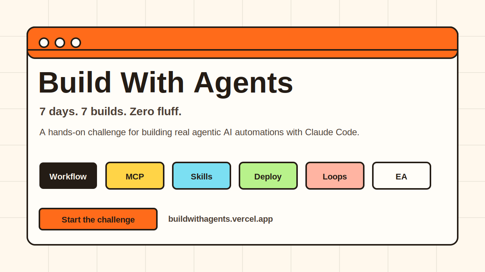

# Build With Agents

> A free 7-day hands-on challenge to build real agentic AI automations with Claude Code.

[Start the challenge](https://buildwithagents.vercel.app/) · [View the 7-day map](https://buildwithagents.vercel.app/#course-map) · [Meet Vishal](https://jaiswal-vishal.vercel.app/)

## Why this exists

Most AI agent content stops at demos. Build With Agents is for people who want working systems.

In 7 days, you go from your first Claude Code workflow to a deployed automation, a screenshot improvement loop, a scheduled agent, and a personal executive assistant folder you can keep extending.

The course is practical by design:

- 7 days
- 7 builds
- Copy-ready prompts
- Concrete checklists
- Claude Code, MCP, Trigger.dev, workflows, skills, and scheduled routines
- No passive watching

## Start here

The full course lives on the site:

[https://buildwithagents.vercel.app/](https://buildwithagents.vercel.app/)

This public repo is the GitHub landing page for the project. Star it if you want to follow the course, share it with your team, or keep a bookmark for agentic AI building patterns.

## Star this repo if

- You want to build AI agents that do useful work, not just chat.
- You are learning Claude Code and want a structured path.
- You care about workflows, tools, MCP servers, and production habits.
- You want a free challenge you can send to a friend or team.
- You believe agentic AI should be built, tested, and documented in public.

## The 7-day walkthrough

| Day | Build | What you learn |
| --- | --- | --- |
| 1 | Newsletter automation | Workflows, `CLAUDE.md`, Plan Mode, review gates |
| 2 | Job listing scraper | MCP servers, Firecrawl, tool selection, structured extraction |
| 3 | Reusable skill | Skill design, references, guardrails, repeatable prompts |
| 4 | Deployed automation | Trigger.dev, env vars, logs, cloud execution |
| 5 | Landing page loop | Frontend build loop, screenshots, visual iteration |
| 6 | Scheduled agent | Autonomous routines, monitoring loops, improvement logs |
| 7 | Executive assistant | Context files, operating rules, personal AI system design |

By the end, you should have a working agentic AI operating system instead of a folder full of experiments.

## What you will build

The challenge walks through a complete progression:

1. A newsletter workflow that researches, drafts, reviews, and sends.
2. A scraping workflow that connects Claude Code to live web data through MCP.
3. A custom skill that turns repeated work into a reusable agent capability.
4. A Trigger.dev task that runs without your laptop.
5. A landing page improvement loop that uses screenshots as feedback.
6. A scheduled automation plus monitoring loop.
7. A personal executive assistant workspace with context, rules, and skills.

Each day has a clear success checklist, common mistakes, and an extension prompt if you want to go deeper.

## Who this is for

Build With Agents is for:

- Operators, analysts, founders, and builders who want working AI systems.
- People willing to open VS Code and run real workflows.
- Teams that want practical automation patterns instead of AI theory.
- Builders who want to understand the system well enough to debug it.

It is not for:

- Passive video watching.
- AI news without implementation.
- Copying prompts without understanding what they do.
- Fully hands-off automation with no review gates or safety rules.

## The core mental model

The course is built around WAT:

| Layer | Meaning | Role |
| --- | --- | --- |
| Workflows | Plain-English process files | Tell the agent what to do and in what order |
| Agent | Claude Code | Reads context, chooses tools, executes steps, fixes build-time issues |
| Tools | APIs, MCP servers, scripts, integrations | Do the real work outside the chat window |

This model keeps agentic systems understandable. If you can read the workflow, inspect the tools, and explain the handoffs, you can improve the automation instead of just hoping it works.

## Course site

The complete challenge, downloadable resources, prerequisites, capstone, and live cohort details are here:

[Launch Build With Agents](https://buildwithagents.vercel.app/)

## About the creator

Build With Agents is created by Vishal Jaiswal, an AI and analytics leader with 15+ years across e-commerce, chemicals, CRM intelligence, fintech, and credit risk.

- Portfolio: [jaiswal-vishal.vercel.app](https://jaiswal-vishal.vercel.app/)
- LinkedIn: [vishal-jaiswal-analytics-leader](https://www.linkedin.com/in/vishal-jaiswal-analytics-leader/)
- GitHub: [vishalmdi](https://github.com/vishalmdi)

## FAQ

### Is the course free?

Yes. The 7-day course, prompts, capstone, and downloadable files are free on the website.

### Is this repo the full course source?

No. This repo is the public GitHub landing page and walkthrough. The course experience lives on the site.

### Can I copy or resell the material?

No. The material is copyrighted by Vishal Jaiswal. Commercial use, copying, redistribution, resale, and republishing are not allowed without written permission.

### Do I need to know how to code?

You need to be comfortable using VS Code and following instructions. The course is designed so you do not write code blind.

### What tools are used?

Claude Code, VS Code, Firecrawl MCP, Trigger.dev, and practical workflow files. The exact tools vary by day.

## Copyright

Copyright (c) 2026 Vishal Jaiswal. All rights reserved.

This repository is provided for discovery and educational reference only. See [COPYRIGHT.md](COPYRIGHT.md) for the full usage restrictions.
